# Banco Popular uses Azure Bot Service to provide better support to their clients in Puerto Rico #

## Overview ##
In this article we will review how Banco Popular de Puerto Rico[[1]](#references) and Microsoft colaborate to build an assistant bot that allows the bank customers to find information and answers at the bank page in their own terms.

Every day, thousands of clients enter Banco Popular's website looking for information regarding:
- How to open a bank account,
- What to do if a credit card has been stolen or lost,
- How to get a credit card,
- What is the bank's route and tranist number,
- Make an online payment,
- Insurance offerings
- How to request a loan, among other questions.

Given the vast services that the bank offers, information provided at the site could be overwhelming and difficult to reach at first to current and potential clients. So Banco Popular built a chat bot to their spanish speaking clients but they felt they could do better in terms of having a more practical yet human bot to assist their clients.

While this hackfest objectives are to build a proof of concept on how the bot should interact with users, we want to build a fully functioning bot covering multiple scenarios and allowing customers to have an assistant that will give them straight information of redirect them to the correct bank site.
 
After this interaction, Banco Popular's next step is to connect the Bot to their core and offer personalized interactions to current clients based on previous conversations.

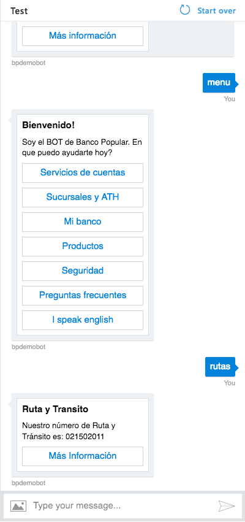 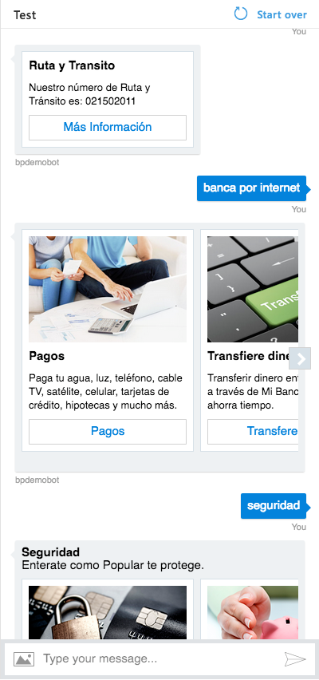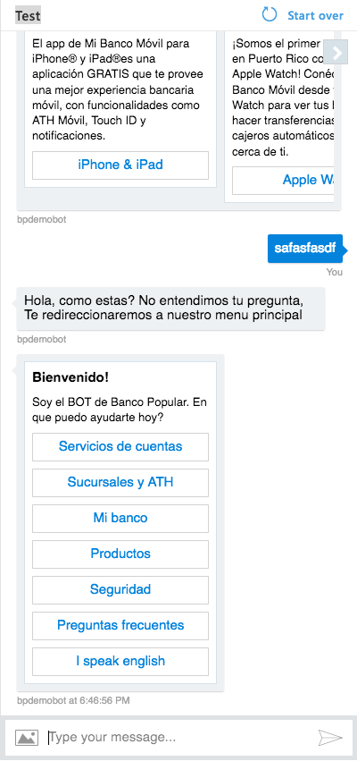
><i>Images 1-3. Screenshots of the Bot we built during this hackfest.</i>

### Key technologies ###
- NodeJS
- Azure Bot Service
- Bot Builder SDK
- QnA Maker

### Core team ###
The hackfest counts with the participation of both Microsoft and Banco Popular teams:

- Banco Popular
    - Luis Matos, IT Supervisor and sponsor of the project
    - Provimar Diaz, Product Manager and sponsor of the project
    - Hector O’Farrill, Developer
    
- Microsoft
  - Jorge Cupi, Software Engineer, <a href="http://twitter.com/JorgeCupi">@JorgeCupi</a>
  - Carla Lopez, Cloud Solution Architect

## Customer profile ##


Founded in 1893, <b>Banco Popular</b> is a full-service financial services provider with operations in Puerto Rico, the United States and Virgin Islands. Popular, Inc. is the largest banking institution by both assets and deposits in Puerto Rico and in the United States ranks among the 50 largest banks and thrifts by total assets. 

## Problem Statement ##
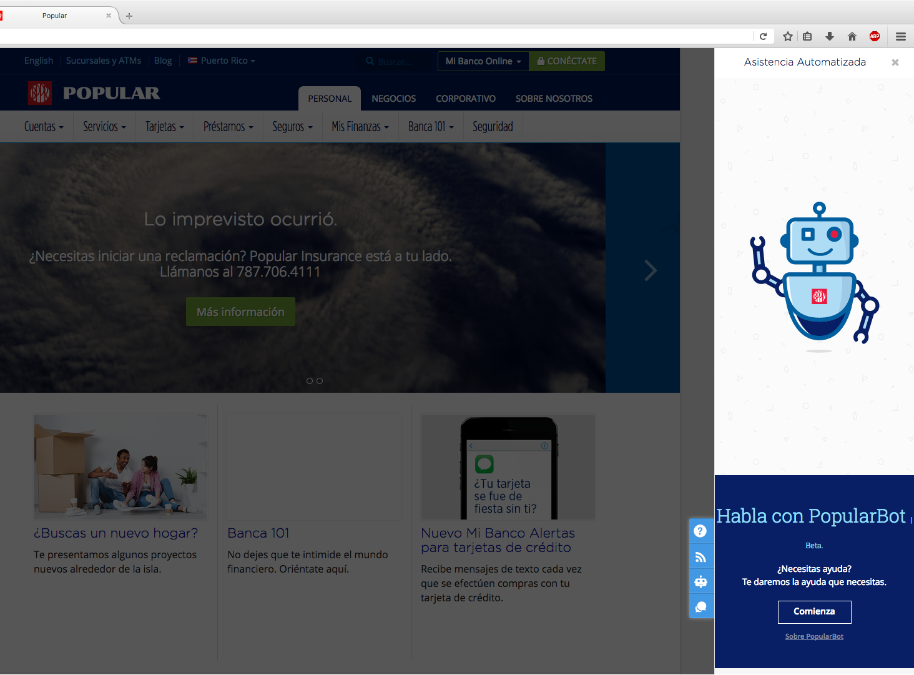
><i>Image 5. Banco Popular already has a live bot in their website.</i>

Banco Popular's current bot have scenarios that need improvement:
- Banco Popular feels the bot as non intuitive to users who are not familiar with chatbots or technology in general,
- Sometimes, once a user starts an interaction it can not return back to the bot main menu and a browser refresh is needed to start a new conversation.
- With technologies such as Language Understanding Intelligent Services (LUIS), QnA maker, plain regular expressions and others, the bank team does not have a clear path on which services to use and why or how to use them.


<i>“No matter the technologies used, we want <b>Popular Bot</b> to be more functional to our clients. They need to feel the service is really helpful and more human friendly and not just a bot that answers their questions with plaint text”</i> – <b>Luis Matos, IT Supervisor - Banco Popular.</b>

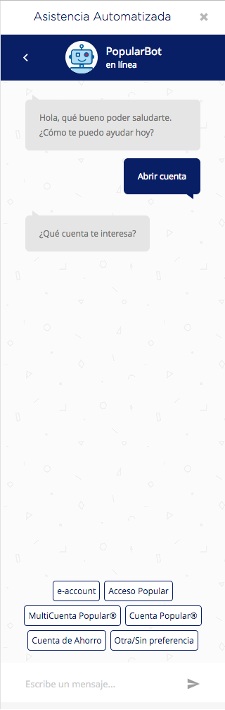 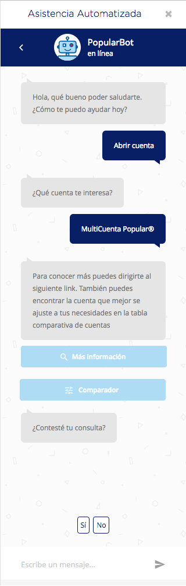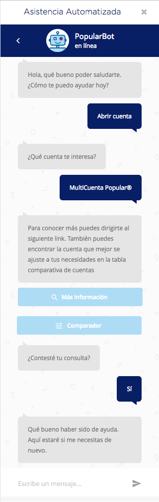

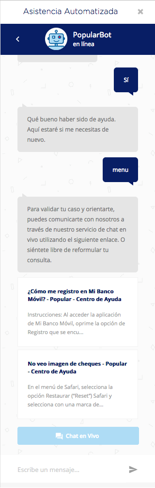 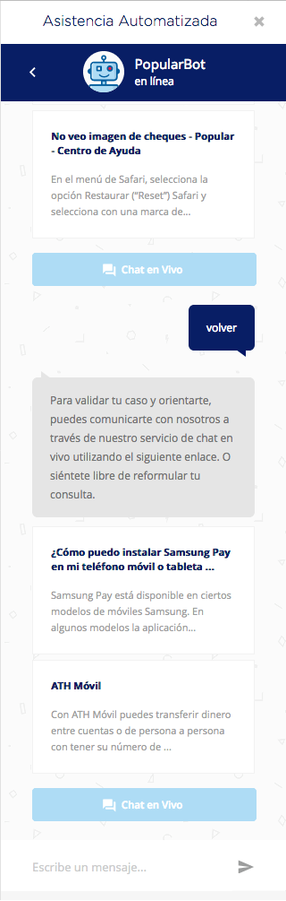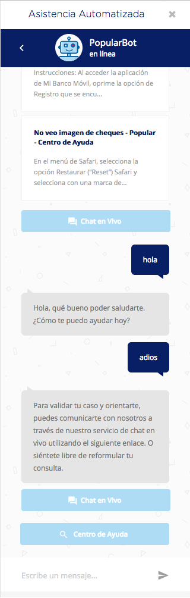
><i>Images 6-11. Banco Popular already has a running bot that needs improvement.</i>

## Solution and steps ##
What was proposed in an initial meeting was to review the current bot state and see what could be recycled or if it was better to start over. Also, before choosing technologies it was necessary to redefine what questions we wanted to answer with the bot and once we what we called a 'conversation tree' we could choose appropiate services and define an architecture.

### Defining a conversation tree ###

> <b>First expectations from the bot.</b>
>
> Human: Hi
>
>Bot: Hello, good morning. I'm Popular Bot and I'm here to help you.
>
>Human: I want to open an account at the bank
>
>Bot: Sure thing, we have different accounts to offer you. Which one would you preffer? 
>- A savings account?
>- A checking account?
>- A student account?
>
>Human: Savings account
>
>Bot: Perfect, I can get you in contact with an assistant that will help you with the process. Is there something else I can do for you?
>
>Human: No, thanks
>
>Bot, Ok, You'll be contacted by one of our account managers to create your savings account.

- First, the bot needs to answer greetings but not necessarily expect them. Some users might start with a "hello" while others could jump straight to seek for answers.
- Second, building a 'follow up' conversation bot would be complex and time consuming to manage in the long term given the number of services the bank offers. 
- Finally, the 'spanglish' situation would add extra complexity for the bot to understand the customer's needs.

### Client first mindset ###
We want to build a conversation tree with the bank's most important services so the user can reach their answer in less than five clicks through a series of menus.

#### What does 'client first' mean? ####

As an example: The savings accounts for teenagers are called "ATH POP" and "Club del ahorro"
 or a checking account for college students is called "Acceso universitario" and, while all of them are 'bank accounts' from a customer perspective, they belong to different verticals at the bank given the vast ammount of services they provide to their clients.

So, we built a set of categories 'thinking as a client'
thanks to the participation of the product manager and her domain expertise. 
We ended up with the following main tree:
- 'Servicios' (most used services for bank customers)
- 'Sucursales y ATH' (Find an ATM or office near you)
- 'MiBanco' (online and mobile services for bank customers)
- 'Productos' (services for new customers)
- 'Seguridad' (security policies and recommendations from the bank)
- 'Preguntas' frecuentes (FAQ)

Each menu item will have a menu of its own once the customer selects it. As an example, the "MiBanco" section will have the next menu:
- Banca por Internet
    - Pagos
    - Transferencias
    - Estados electronicos
    - miBanco alertas
- Banca movil
    - Retiro movil
    - Deposito facil movil
    - ATH Movil
    - Apps


><i>Over 60 differents bank offerings are mapped within the conversation tree.</i>

But what happens if the users starts typing in the chat ignoring the menus? Well, our bot still has to know what the user wants. Thas is why we think about intelligent services that will help us with this chore during the architectural design session.

## Architecture ##

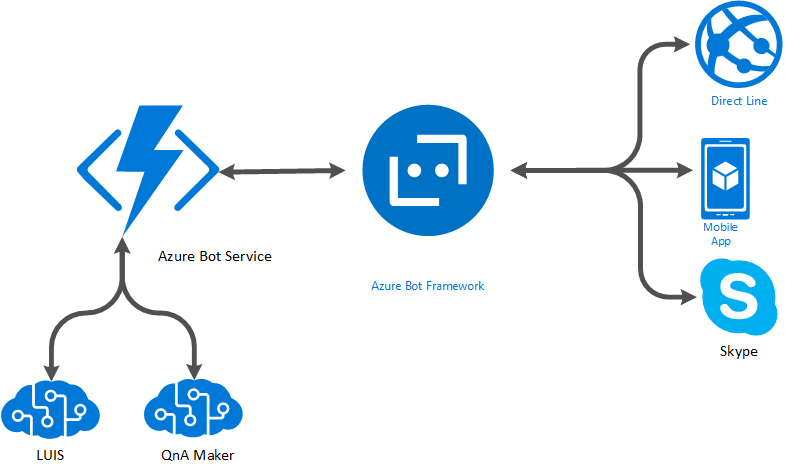


#### Bot Builder SDK [[2]](#references) ####
It is a set of Open source SDKs  that allow a client to build bots that have:
- Simple to sophisticated dialogs that handle a user's conversation state,
- Waterfalls, carrousels, interactive menus,
- Integration with Cognitive Services to understand the users intentions.

#### Bot Framework [[3]](#references) ####
It is a platform that acts as a bot orchestrator by:
- Handling multiple channels like Skype, Microsoft Teams, Facebook Messenger, Kik, Microsoft Cortana, among others via its connectors,
- Managing the bot's settings like name, endpoint, logo for some channels, etc.

#### Bot Service [[4]](#references) ####
It is a Platform as a Service (PaaS) offering in Microsoft Azure that helps users easily host their bot code in Azure Functions and connect them to a bot created in the Bot Framework platform.

We will host our bot build using Bot Builder SDK using Azure Bot Service.

#### Cognitive Services: Language Understanding Intelligent Service (LUIS) [[5]](#references) ####
LUIS is a service that offers the developers a way to build smart applications that can understand human language and react accordingly to user requests. LUIS uses the power of machine learning to solve the difficult problem of extracting meaning from natural language input, so that your application doesn't have to. Any client application that converses with users, like a dialog system or a chat bot, can pass user input to a LUIS app and receive results that provide natural language understanding.

#### Cognitive Services: QnA maker [[6]](#references) ####
Microsoft QnA Maker is a free, easy-to-use, REST API and web-based service that trains AI to respond to user's questions in a more natural, conversational way. Compatible across development platforms, hosting services, and channels, QnA Maker is the only question and answer service with a graphical user interface—meaning you don’t need to be a developer to train, manage, and use it for a wide range of solutions.

## Technical delivery ##
If you want to create your own bot, we won't cover the whole procedure in the remaining of this article. However, you can start with the creation of a bot from scratch now by creating an Azure account <a href="https://azure.microsoft.com/en-us/">here</a> and supporting you with the [references](#references) found at the end.

#### Creating and hosting a bot ####
First we need to create a new Azure Bot Service in our Azure portal:

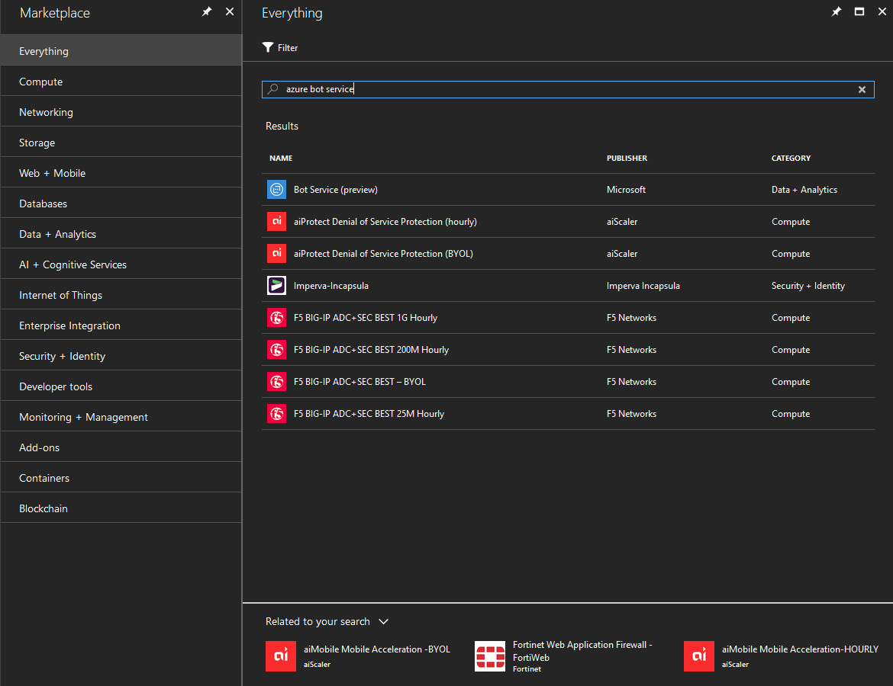

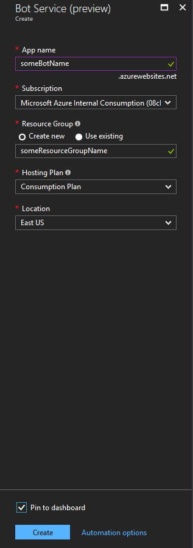

Since Azure Bot Service is integrated with Azure Bot Framework, once we start creating our bot the wizard asks us to create a new Microsoft App ID. Why? Because The bot Framework uses this ID to create the bot in its directory to later publish it to multiple channels.

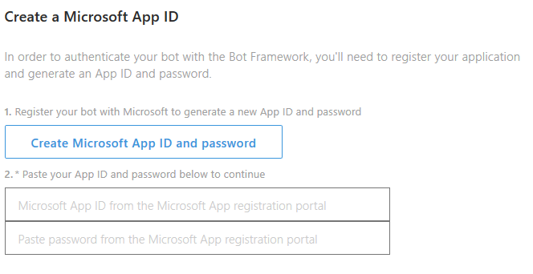

Once we have generated a new ID and password from the App registration portal we can either choose C# or Node JS to build our bot. Banco Popular developers have more proficiency in Javascript so we'll stick with Node JS and select the 'Basic' template:

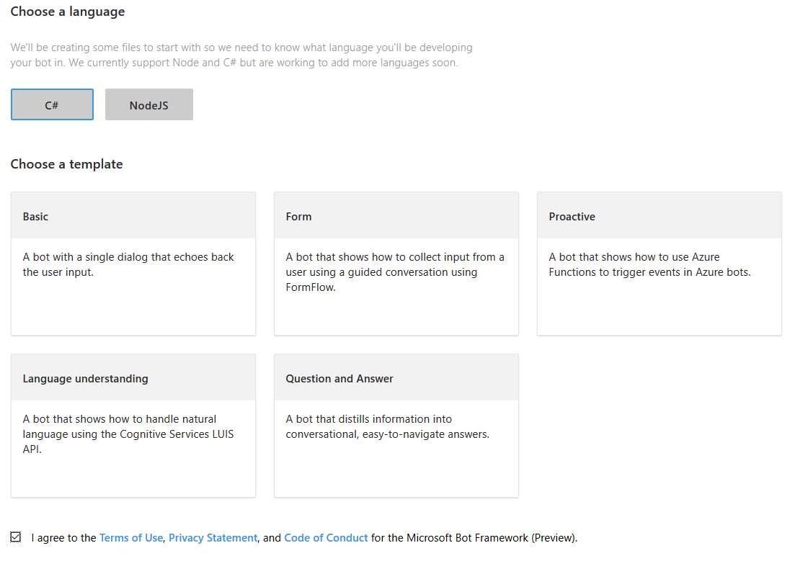

Bot Builder kicks in as we import the SDK to use it for creating our dialogs according to the conversation tree we designed before:

```javascript
var builder = require("botbuilder");
var botbuilder_azure = require("botbuilder-azure");
var path = require('path');
const request = require('request');
```

For testing purposes we declare a 'useEmulator' variable that will allow us to use the Bot Emulator App [[7]](#references) for Windows, Linux or Mac deskptops: 

```javascript
var useEmulator = (process.env.NODE_ENV == 'development');

var connector = useEmulator ? new builder.ChatConnector() : new botbuilder_azure.BotServiceConnector({
    appId: process.env['MicrosoftAppId'],
    appPassword: process.env['MicrosoftAppPassword'],
    stateEndpoint: process.env['BotStateEndpoint'],
    openIdMetadata: process.env['BotOpenIdMetadata']
});

if (useEmulator) {
    var restify = require('restify');
    var server = restify.createServer();
    server.listen(3978, function() {
        console.log('test bot endpoint at http://localhost:3978/api/messages');
    });
    server.post('/api/messages', connector.listen());    
} else {
    module.exports = { default: connector.listen() }
}
```

We are ready to initialize our bot and start building dialogs:
```javascript
var bot = new builder.UniversalBot(connector);
bot.localePath(path.join(__dirname, './locale'));
```

#### Cognitive services ####
After a second review of our conversation tree and current usage from the bank chatbot we notice that users tend to write simple statements like:
> <i>
- "ruta y transito"
- "cuentas"
- "banca movil"
- "robo de tarjeta"  
 </i>

 instead of complex sentences such as:
> <i>
- "necesito informacion sobre las tarjetas de credito del banco"
- "como puedo abrir una cuenta de ahorros?"
- "muestrame los cajeros mas cercanos a la region Norte de la ciudad"
- "cuales son los pasos para reportar una robo de tarjeta de credito?"  
 </i>
 
 This doesn't mean that complex sentences are not written at all but they rarely appear. So, the question arises: 
 
 <b><i>Should we use LUIS at all?</i></b> 
 Let's remember, LUIS is useful when we want to detect the intention of a user in a sentence. But, since most users won't write full complex sentences we could leverage Bot Builder's "Action Triggers" for simple queries and QnA Maker for long questions.

 Let's create a QnA account by going to https://qnamaker.ai/ and signing in with a Microsoft Account and clicking the "Create new service" tab:

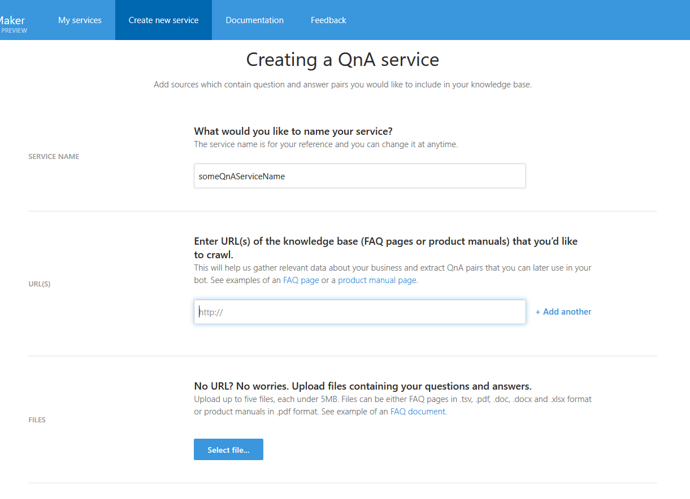
 
Once we assign a name to the service we must choose one of three options:
- Insert URLs from our websites FAQs,
- Upload a .pdf, .doc, .docx, .xlsx or .tsv file that contains the questions and answers we want to be answered,
- Start from scratch by creating our own questions and answers in a later page.

Once we have our questions and answers, we just need to click on 'Save & retrain' and then 'Publish'
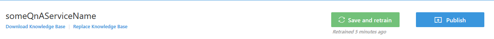

Now we have two keys in the next screen:
- Ocp-Apim-Subscription-Key as QnAKey
- Knowledge Base as QnABase

which we'll save in our Azure Function App settings by clicking the "Settings" tab and then opening the "Application settings":
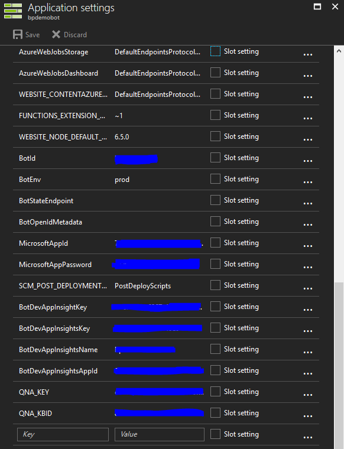


Bot Builder comes with a built in functionality to work with QnA Maker [[8]](#references):

```javascript
var recognizer = new cognitiveservices.QnAMakerRecognizer({
	knowledgeBaseId: 'set your kbid here', 
	subscriptionKey: 'set your subscription key here'
});

var BasicQnAMakerDialog = new cognitiveservices.QnAMakerDialog({ 
	recognizers: [recognizer],
	defaultMessage: 'No good match in FAQ.',
	qnaThreshold: 0.5
});

bot.dialog('/', basicQnAMakerDialog);
```

However, since our bot does not work exclusively with QnA maker but with different dialogs and Action Triggers from Bot Builder, we will have to call QnA maker service using HTTP POST requests to the URI: 

```javascript
const uri = `https://westus.api.cognitive.microsoft.com/qnamaker/v1.0/knowledgebases/${process.env.QNA_KBID}/generateAnswer`;
```

Our bot is now ready to start dialogs with the bank clients:
- The 'root' dialog will grab the user's message and try to get an answer from QnA maker.
- If QnA maker has an answer available (available meaning that has a predicted score of at least 80/100) it will be shown to the user. - Otherwise, Bot Builder's Action triggers will try to catch the phrase / keywords written by the user 
- Finally, it the keywords / phrase written by the user does not land on a bot dialog, the main dialog will display a 'I'm sorry, I couldn't catch you' message and will show the user the bot main menu:

```javascript
bot.dialog('/',function(session){
    session.sendTyping();
    
    const bodyText = JSON.stringify({question: session.message.text});
    
    request.post(uri, { body: bodyText }, (err, code, body) => {
        if(err)
            session.endConversation('Oops! Perdon pero no podemos procesar esta pregunta en este momento. Mil disculpas por el inconveniente.');
        else{
            const response = JSON.parse(body);
            if(response.score >= 80) {
                session.endConversation(response.answer);
            } else if (response.score < 80) {
                session.send("Hola, como estas? No entendimos tu pregunta, Te redireccionaremos a nuestro menu principal");
                session.beginDialog('menu');
            }
        }
    }).setHeader('Ocp-Apim-Subscription-Key', process.env.QNA_KEY);
});
```

Given the nature of our bot mission, and the conversation tree we defined, a waterfall design would make sense:

```javascript
bot.dialog('greetings', [
    // Step 1
    function (session) {
        builder.Prompts.text(session, 'Hi! What is your name?');
    },
    // Step 2
    function (session, results) {
        session.endDialog(`Hello ${results.response}!`);
    }
]);
```

However, bank clients tend to start new queries from different products before finishing a complete dialog and asking them to quit one waterfall before joining a new one would not be user friendly or practical. That's why we decided to use separate dialogs for each of the bank mapped services: 

> <i>For practical purposes, we will only include a couple of dialog samples from the bot that we built </i>

```javascript
bot.dialog('seguridad', function(session){
    
    var msg = new builder.Message(session);
    msg.text("#### Seguridad ####\n\nEnterate como Popular te protege.")
    msg.attachmentLayout(builder.AttachmentLayout.carousel)
    msg.attachments([
        new builder.HeroCard(session)
            .title("Tarjetas")
            .text("Conoce cómo protegemos tus tarjetas con las tecnologías más avanzadas en el mercado.")
            .images([builder.CardImage.create(session, 'http://www.popular.com/assets/uploads/tarjeta.png')])
            .buttons([
                builder.CardAction.openUrl(session, "http://www.popular.com/seguridad/tarjetas/", "Tarjetas")
            ]),
        new builder.HeroCard(session)
            .title("Cuentas")
            .text("Constantemente estamos monitoreando la actividad en tus cuentas de cheques y ahorros para así prevenir transacciones no autorizadas.")
            .images([builder.CardImage.create(session, 'http://www.popular.com/assets/uploads/cuentas.png')])
            .buttons([
                builder.CardAction.openUrl(session, "http://www.popular.com/seguridad/cuentas/", "Cuentas")
            ]),
        new builder.HeroCard(session)
            .title("Email")
            .text("Conoce algunas de las técnicas de fraude más comunes en los emails y como prevenirlas.")
            .images([builder.CardImage.create(session, 'http://www.popular.com/assets/uploads/email.png')])
            .buttons([
                builder.CardAction.openUrl(session, "http://www.popular.com/seguridad/email/", "Email")
            ]),
        new builder.HeroCard(session)
            .title("En Linea")
            .text("Conoce algunas de las técnicas de fraude más comunes en los emails y como prevenirlas.")
            .images([builder.CardImage.create(session, 'http://www.popular.com/assets/uploads/en_linea.png')])
            .buttons([
                builder.CardAction.openUrl(session, "http://www.popular.com/seguridad/en-linea/", "En linea")
            ]),
        new builder.HeroCard(session)
            .title("Movil")
            .text("Con las funcionalidades de Mi Banco Online te mantenemos seguro. Además, conoce sobre las tipos de fraude en móviles.")
            .images([builder.CardImage.create(session, 'http://www.popular.com/assets/uploads/m_vil.png')])
            .buttons([
                builder.CardAction.openUrl(session, "http://www.popular.com/seguridad/movil/", "Movil")
            ]),
        new builder.HeroCard(session)
            .title("ATM")
            .text("Conoce de la seguridad en las ATM y tips de qué hacer para mantenerte protegido.")
            .images([builder.CardImage.create(session, 'http://www.popular.com/assets/uploads/atm.png')])
            .buttons([
                builder.CardAction.openUrl(session,"http://www.popular.com/seguridad/atm/", "ATM")
            ])
    ]);
    session.endConversation(msg);
}).triggerAction({matches:/^seguridad|Seguridad|segrdad|Segurdad/});

```


```javascript
bot.dialog('preguntasFrecuentes', function(session){
    card = new builder.HeroCard(session)
        .title("Preguntas Frecuentes")
        .text("Aqui puedes encontrar la contestacion a tus preguntas")
        .buttons(
            [
                builder.CardAction.postBack(session,"Cambio de PIN", "Cambio de PIN"),
                builder.CardAction.postBack(session,"Como funciona el chip de mi tarjeta", "Como funciona el chip de mi tarjeta?"),
                builder.CardAction.postBack(session,"Banca Internacional", "Banca Internacional"),
                builder.CardAction.postBack(session,"Como puedo solicitar una tarjeta de debito", "Como puedo solicitar una tarjeta de debito?"),
                builder.CardAction.openUrl(session,"https://helpcenter.popular.com/", "No encuentas tu pregunta? Ingresa aquí.")

            ]
        );

    var msg = new builder.Message(session);
    msg.attachmentLayout(builder.AttachmentLayout.carousel);
    msg.attachments([card]);

    session.endConversation(msg);
}).triggerAction({matches:/^FAQ|Preguntas|preguntas|Preguntas Frecuentes|preguntas frecuentes|frecuentes|prengunta frecuente/});
```

#### Publishing the bot ####
Now that all of the dialogs are complete, publishing our bot to multiple channels is as easy as enabling them on the 'Channels' tab:
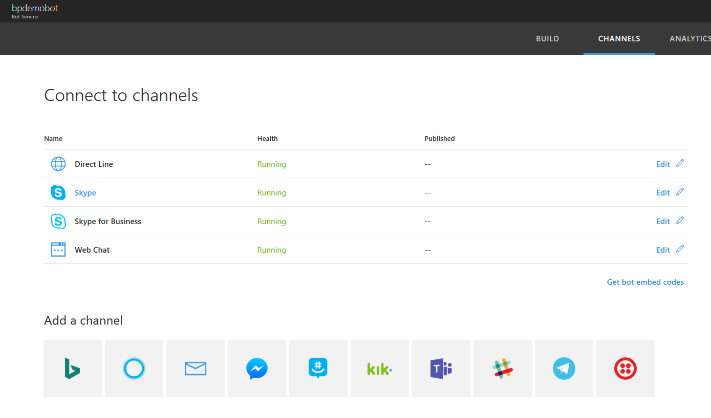

## Conclusion ##
During our week hackaton, we were able to rethink, design, create and publish a customer self service bot that covered Banco Popular's main needs for a bot.

<i>“The expectations we had of what could have been done in 4 days have been surpassed. To create a unique experience focused on our client's needs and to provide a well organized and complete content converts to <b>Popular Bot</b> into a great self service tool”</i> – <b>Provimar Diaz Toro, Product Manager - Banco Popular.</b>


### Learnings ###
To succesfully develop a bot it is important, if not critical, to first discuss what needs will the bot cover and write down in paper some questions the bot needs to answer. Only after this is done we can start to choose technologies and write code. Not the other way around.

While services like LUIS.ai, API.ai are usually used hand to hand in the construction of bots. They are not always necessary like we saw in this engagement. In fact, such services should be the lasts to think about when designing a bot and use them only if the situation requires it. Before creating and solving complex language scenarios we should as ourselves if our bot will or should work with such scenarios. So, we should ask some of the next questions:
- Can I solve my complex language scenario with a menu instead of asking the user to freely write anything?
- Should my bot or the user guide the conversation flow?
- Are most of the user's answers just "yes" or "no" statements? Do I need cognitive services for that?

While Bot Services are in preview, there are things that could improve like:
- As of today, the Bot Builder SDK has built in functions for QnA and LUIS but QnA dialogs don't have much customization to decide what to do in case A or B with an answer.
- There's no easy way to deploy a multi language bot:
  - Not from an answering point of view. This could be done using Bing Translator services [[1]](#references),
  - But from a bot perspective in the sense that if the bot receives a spanish message it should have a resource dictionary to display a spanish answer, and the same for multiple languages. This would work for countries that have multiple official languages.


### Looking forward ###
The developer team from the bank is now aware of the capabilities from Microsoft's Bot services (Bot Builder, Bot Framework, Bot Services, Cognitive Services) and they are ready for next iterations on the bot that cover:
- LUIS integration for more complex user queries,
- Custom treatment for their clients supporting the bot with a database,
- Integrate their help desk service with the bot to complement the work done with QnA maker


## References ##
[1] Banco Popular. 2017. Pagina Principal https://www.popular.com/en/ 

[2] Microsoft. 2017. Bot Builder SDK https://github.com/Microsoft/BotBuilder

[3] Microsoft. 2017. Bot Framework https://dev.botframework.com/

[4] Microsoft. 2017. Bot Service  https://docs.microsoft.com/en-us/bot-framework/azure-bot-service-overview

[5] Microsoft. 2017. LUIS overview. https://docs.microsoft.com/en-us/azure/cognitive-services/LUIS/Home 

[6] Microsoft. 2017. QnA Maker. https://qnamaker.ai/Documentation

[7] Microsoft. 2017. Bot Emulator. https://github.com/Microsoft/BotFramework-Emulator/tree/v3.5.31 

[8] Microsoft. 2017. QnA Maker built in function on Bot Builder https://github.com/Microsoft/BotBuilder-CognitiveServices/tree/master/Node 